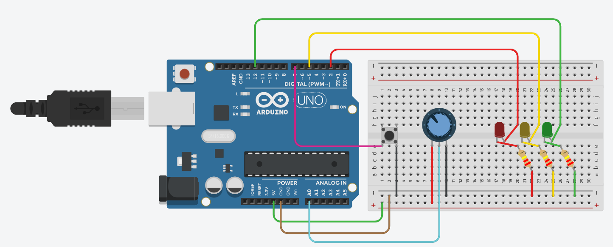
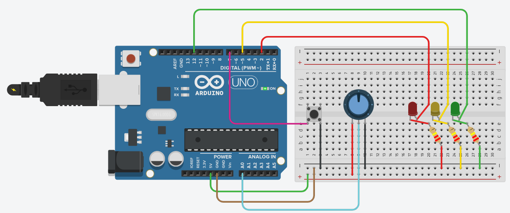
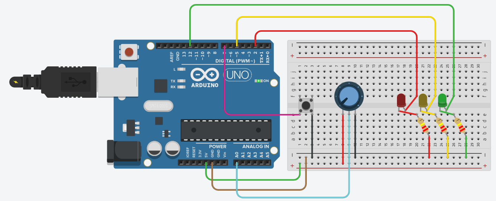
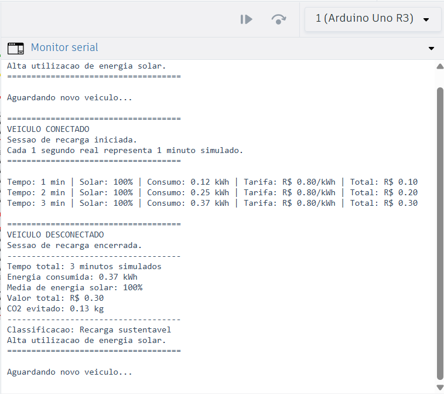

# Smart Solar ChargeGrid

## Integrantes

- David Gabriel Silva de Souza – RM: 574147
- Enzo Christino – RM: 572037
- Guilherme Guimarães – RM: 572957
- Lucas Pinheiro – RM: 573497
- João Lucas – RM: 571355
- Filipe Gunther - RM: 571131

---

# Visão Geral

O Smart Solar ChargeGrid é uma prova de conceito funcional desenvolvida para a Sprint 2 do projeto de Soluções em Energias Renováveis e Sustentáveis.

O objetivo da solução é simular um eletroposto inteligente capaz de monitorar uma sessão de recarga de veículos elétricos, considerar a disponibilidade de energia solar durante o carregamento, aplicar uma tarifação dinâmica e gerar indicadores de consumo, custo e sustentabilidade.

A proposta representa uma evolução prática da solução apresentada na Sprint 1, que abordava gestão inteligente de eletropostos, integração com energia renovável e eficiência energética.

---

# Problema

Com o crescimento da mobilidade elétrica, surge a necessidade de sistemas capazes de:

- Gerenciar sessões de recarga;
- Incentivar o uso de energia renovável;
- Reduzir a dependência da rede elétrica convencional;
- Oferecer transparência no cálculo de consumo e custos;
- Gerar indicadores ambientais relacionados à recarga.

---

# Solução Proposta

O Smart Solar ChargeGrid simula uma estação de recarga inteligente utilizando Arduino Uno R3 e Tinkercad.

O sistema é capaz de:

- Detectar a conexão de um veículo;
- Simular diferentes níveis de geração solar;
- Classificar a disponibilidade energética;
- Calcular tempo de recarga;
- Calcular consumo energético;
- Aplicar tarifa dinâmica;
- Estimar CO₂ evitado;
- Gerar um relatório final da sessão.

---

# Relação com a Sprint 1

Na Sprint 1 foi proposta uma solução baseada em:

- Controle de demanda;
- Tarifação inteligente;
- Integração com energia solar;
- Sustentabilidade;
- Gestão de eletropostos.

Na Sprint 2, esses conceitos foram transformados em uma prova de conceito funcional que demonstra o funcionamento de uma sessão de recarga inteligente.

---

# Componentes Utilizados

- Arduino Uno R3
- Placa de ensaio pequena
- Botão
- Potenciômetro
- LED Vermelho
- LED Amarelo
- LED Verde
- Resistores de 220 Ω
- Jumpers
- Monitor Serial

---

# Arquitetura do Sistema

| Componente | Função |
|------------|---------|
| Botão | Simula o veículo conectado |
| Potenciômetro | Simula a geração solar |
| LEDs | Indicam o nível de energia solar |
| Arduino Uno | Processa os cálculos |
| Monitor Serial | Exibe os resultados da sessão |

Fluxo do sistema:

```text
Veículo conectado
        ↓
Leitura da geração solar
        ↓
Classificação da disponibilidade energética
        ↓
Cálculo de consumo
        ↓
Aplicação de tarifa dinâmica
        ↓
Geração de relatório final
```

---

# Funcionamento

O botão representa a conexão do veículo ao eletroposto.

Quando o botão é pressionado:

- Uma sessão de recarga é iniciada;
- O sistema começa a contabilizar tempo;
- O consumo energético é calculado continuamente;
- A tarifa é definida conforme a geração solar.

O potenciômetro representa a disponibilidade de energia solar.

Dependendo da posição do potenciômetro:

| LED | Situação |
|------|-----------|
| Vermelho | Baixa geração solar |
| Amarelo | Geração solar média |
| Verde | Alta geração solar |

---

# Tarifação Dinâmica

O sistema utiliza tarifação dinâmica baseada na disponibilidade de energia solar.

| Situação | Tarifa |
|-----------|----------|
| Baixa geração solar | R$ 1,30/kWh |
| Geração média | R$ 1,00/kWh |
| Alta geração solar | R$ 0,80/kWh |

Quanto maior a participação da energia solar, menor a dependência da rede elétrica e menor o custo da recarga.

---

# Cálculo de Consumo

Foi adotada uma potência simulada de:

```text
7,4 kW
```

Para a demonstração:

```text
1 segundo real = 1 minuto simulado
```

O sistema calcula automaticamente:

- Tempo de utilização;
- Energia consumida;
- Valor da recarga.

---

# Indicador Ambiental

Além dos dados financeiros e energéticos, o sistema calcula uma estimativa de CO₂ evitado com base na participação da energia solar durante a sessão.

Essa funcionalidade demonstra como sistemas inteligentes podem contribuir para indicadores de sustentabilidade.

---

# Evidências

## Circuito Completo



## Baixa Geração Solar


## Geração Solar Média



## Alta Geração Solar



## Resultado da Sessão



---

# Código Fonte

O código utilizado no projeto está disponível em:

```text
codigo/smart_solar_chargegrid.ino
```

---

# Limitações da Prova de Conceito

Por se tratar de uma simulação acadêmica:

- O potenciômetro substitui um painel solar real;
- O botão substitui a conexão física de um veículo;
- O cálculo de CO₂ possui caráter estimativo;
- Não existe integração real com meios de pagamento;
- Não existe integração com OCPP;
- Não existe armazenamento em banco de dados.

---

# Melhorias Futuras

- Integração com painel solar físico;
- Sensores reais de corrente e tensão;
- Dashboard web;
- Banco de dados para sessões;
- Aplicativo para usuários;
- Integração com pagamento digital;
- Comunicação via OCPP;
- Inteligência artificial para previsão de demanda.

---

# Conclusão

O Smart Solar ChargeGrid demonstra a viabilidade inicial de uma solução de recarga inteligente para veículos elétricos.

A prova de conceito valida conceitos de monitoramento energético, tarifação dinâmica e sustentabilidade, demonstrando na prática uma aplicação alinhada aos objetivos apresentados na Sprint 1.
